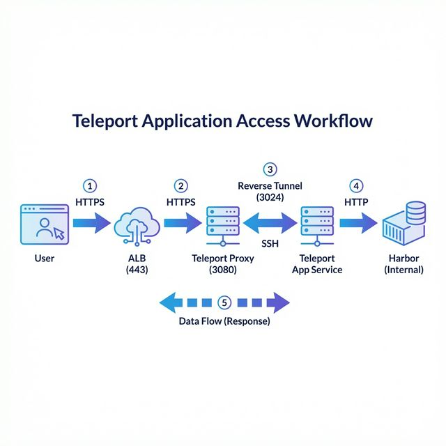
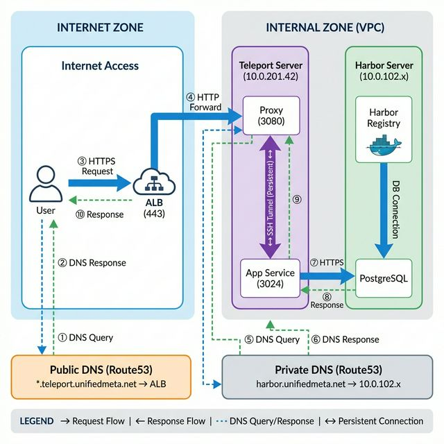

# Teleport Application Access 워크플로우 심층 분석

이 문서는 사용자가 Teleport UI를 통해 Harbor에 접근할 때의 전체 워크플로우를 상세히 설명합니다.

---

## 전체 아키텍처 개요

### 워크플로우 다이어그램
사용자 요청이 각 구성 요소를 거쳐 Harbor까지 전달되는 흐름입니다.



### 물리 아키텍처 다이어그램
실제 서버와 네트워크 구성을 보여줍니다.



---

## DNS Query vs DNS Resolve 차이점

> **중요**: 다이어그램에서 **DNS Query**와 **DNS Resolve**로 표기했지만, 둘 다 본질적으로 **같은 DNS 쿼리 동작**입니다. 
> 차이점은 **어디서**(Internet vs VPC 내부) **어느 DNS에**(Public vs Private) 질의하느냐입니다.

**DNS Query**와 **DNS Resolve**는 본질적으로 같은 동작(DNS 이름 → IP 주소 변환)이지만, **컨텍스트**와 **접근 대상**이 다릅니다.

| 구분 | Public DNS Query (①②) | Private DNS Query (⑤⑥) |
|------|----------------------|------------------------|
| **주체** | 사용자 브라우저 | Teleport App Service |
| **대상** | Public DNS Zone | Private DNS Zone |
| **도메인** | `*.teleport.unifiedmeta.net` | `harbor.unifiedmeta.net` |
| **결과** | ALB의 Public IP | Harbor의 Private IP (10.0.102.x) |
| **용도** | 외부 접근 (Internet → ALB) | 내부 통신 (VPC 내부) |

### 실제 동작 예시

**① Public DNS Query:**
```bash
# 사용자 브라우저
dig harbor.teleport.unifiedmeta.net @8.8.8.8

# 응답 (Public DNS Zone)
harbor.teleport.unifiedmeta.net. → CNAME → ALB DNS
ALB DNS → A → 52.79.x.x (Public IP)
```

**⑤ Private DNS Query:**
```bash
# App Service (EC2 내부)
dig harbor.unifiedmeta.net @10.0.0.2  # VPC DNS

# 응답 (Private DNS Zone)
harbor.unifiedmeta.net. → CNAME → harbor-alb-internal.elb.amazonaws.com
→ A → 10.0.102.x (Private IP)
```

### Split-Horizon DNS

같은 도메인(`harbor.unifiedmeta.net`)이 **접근 위치**에 따라 다른 IP로 해석됩니다:
- **인터넷**: Public DNS → Public IP (ALB)
- **VPC 내부**: Private DNS → Private IP (직접 접근)

이를 **Split-Horizon DNS** 또는 **DNS View**라고 합니다.

---

## 핵심 구성 요소

| 구성 요소 | 역할 | 포트 |
|-----------|------|------|
| **ALB** | TLS 종료, 외부 트래픽 라우팅 | 443 (HTTPS) |
| **Teleport Proxy** | 인증, 세션 관리, 트래픽 중계 | 3080 (Web) |
| **App Service** | 백엔드 앱 프록시, Reverse Tunnel 관리 | 3024 (Tunnel) |
| **Harbor** | 실제 서비스 (OCI Registry) | 443 (Internal) |

---

## 상세 워크플로우 (8단계)

### 단계 1: 사용자 → ALB (외부 접근)

```
사용자 브라우저
    │
    │ GET https://harbor.teleport.unifiedmeta.net
    │ (HTTPS/443)
    ▼
  [ALB]
```

**동작:**
- 사용자가 `harbor.teleport.unifiedmeta.net` URL로 접근
- DNS 해석: Public Route53 → ALB IP
- ALB가 TLS 종료 (ACM Wildcard 인증서 사용)

**패킷 내용:**
```http
GET / HTTP/1.1
Host: harbor.teleport.unifiedmeta.net
```

---

### 단계 2: ALB → Teleport Proxy (트래픽 전달)

```
  [ALB]
    │
    │ HTTP/1.1 (Port 3080)
    │ X-Forwarded-Host: harbor.teleport.unifiedmeta.net
    ▼
[Teleport Proxy]
```

**동작:**
- ALB가 Target Group을 통해 Teleport EC2 인스턴스의 포트 3080으로 전달
- `X-Forwarded-*` 헤더로 원본 정보 전달

**ALB Listener Rule:**
```hcl
# Wildcard 매칭
host_header = ["*.teleport.unifiedmeta.net"]
→ Forward to Teleport Target Group (3080)
```

---

### 단계 3: Proxy 인증 확인 (세션 검증)

```
[Teleport Proxy]
    │
    │ 세션 쿠키 검증
    │ (__Host-grv_csrf, __Host-session)
    │
    ├── 세션 없음 → 로그인 페이지로 리다이렉트
    │
    └── 세션 유효 → 단계 4로 진행
```

**동작:**
- Proxy가 요청에서 세션 쿠키 확인
- 쿠키가 없으면 로그인 페이지로 302 리다이렉트
- 쿠키가 있으면 Auth Service에서 세션 유효성 검증

**리다이렉트 예시:**
```http
HTTP/1.1 302 Found
Location: https://teleport.unifiedmeta.net/web/login?redirect_uri=https://harbor.teleport.unifiedmeta.net/
```

---

### 단계 4: 로그인 프로세스 (최초 접근 시)

```
[로그인 페이지]
    │
    │ 1. Username + Password
    │ 2. OTP Code (Second Factor)
    │
    ▼
[Auth Service]
    │
    │ 인증 성공 → JWT 생성
    │
    ▼
[세션 쿠키 설정]
```

**인증 플로우:**
1. 사용자가 Username/Password 입력
2. OTP 코드 입력 (second_factor: otp)
3. Auth Service가 자격 증명 검증
4. 성공 시 세션 쿠키 발급

**세션 쿠키 구조:**
```http
Set-Cookie: __Host-session=eyJhbGciOiJSUzI1NiIs...; 
            Path=/; Secure; HttpOnly; SameSite=Strict
```

---

### 단계 5: RBAC 권한 확인 (앱 접근 허용?)

```
[Teleport Proxy]
    │
    │ 사용자 Role 조회
    │ → "access" role의 app_labels 확인
    │
    ├── app_labels: '*:*' → 모든 앱 허용
    │
    └── env: dev 매칭 확인
```

**역할 정의:**
```yaml
kind: role
metadata:
  name: access
spec:
  allow:
    app_labels:
      '*': '*'  # 모든 앱 레이블 허용
```

**Harbor 앱 레이블:**
```yaml
apps:
  - name: harbor
    labels:
      env: dev  # Role의 app_labels와 매칭
```

---

### 단계 6: Reverse Tunnel 통한 트래픽 전달

```
[Teleport Proxy]
    │
    │ SSH-based Reverse Tunnel (Port 3024)
    │ 암호화된 채널
    │
    ▼
[App Service Agent]
```

**핵심 개념 - Reverse Tunnel:**

일반 연결:
```
Client → Server (서버가 포트를 열고 대기)
```

Reverse Tunnel:
```
App Service → Proxy (Agent가 먼저 연결을 맺음)
```

**왜 Reverse Tunnel인가?**
- App Service가 Private Subnet에 있어도 동작
- 방화벽 인바운드 규칙 불필요
- Agent가 Proxy에 "역방향"으로 연결 유지

**터널 설정:**
```yaml
proxy_service:
  tunnel_listen_addr: 0.0.0.0:3024  # 터널 수신
  tunnel_public_addr: $(hostname):3024  # Agent가 연결할 주소
```

**SSH 프로토콜 사용:**
```
┌─────────────────────────────┐
│  SSH Connection (Port 3024) │
│  ┌───────────────────────┐  │
│  │  Multiplexed Channels │  │
│  │  - App Traffic        │  │
│  │  - Heartbeat          │  │
│  │  - Control Messages   │  │
│  └───────────────────────┘  │
└─────────────────────────────┘
```

---

### 단계 7: App Service → Harbor (백엔드 요청)

```
[App Service Agent]
    │
    │ HTTPS Request (insecure_skip_verify: true)
    │
    ▼
[Harbor - 10.0.x.x:443]
```

**동작:**
- App Service가 설정된 URI로 요청 전달
- `insecure_skip_verify: true`로 자체 서명 인증서 허용

**앱 설정:**
```yaml
app_service:
  apps:
    - name: harbor
      uri: https://harbor.unifiedmeta.net
      insecure_skip_verify: true  # 내부 인증서 신뢰
```

**내부 DNS 해석:**
```
harbor.unifiedmeta.net 
  → Private Route53 Zone
  → Harbor EC2 Private IP
```

---

### 단계 8: 응답 역전파

```
[Harbor]
    │
    │ HTML/JSON Response
    ▼
[App Service]
    │
    │ via Reverse Tunnel
    ▼
[Teleport Proxy]
    │
    │ via ALB
    ▼
[사용자 브라우저]
    │
    └── Harbor UI 렌더링! 🎉
```

**응답 헤더 변환:**
- Proxy가 `Set-Cookie` 도메인 재작성
- CORS 헤더 추가
- 보안 헤더 주입

---

## 전체 시퀀스 다이어그램

```
┌──────────┐  ┌─────┐  ┌─────────────┐  ┌─────────────┐  ┌──────────┐
│  User    │  │ ALB │  │   Proxy     │  │ App Service │  │  Harbor  │
│ Browser  │  │     │  │  (3080)     │  │   (3024)    │  │          │
└────┬─────┘  └──┬──┘  └──────┬──────┘  └──────┬──────┘  └────┬─────┘
     │           │            │                │               │
     │ HTTPS/443 │            │                │               │
     │──────────>│            │                │               │
     │           │ HTTP/3080  │                │               │
     │           │───────────>│                │               │
     │           │            │                │               │
     │           │            │ 세션 확인       │               │
     │           │            │───┐            │               │
     │           │            │   │ 쿠키?      │               │
     │           │            │<──┘            │               │
     │           │            │                │               │
     │  302 Redirect (로그인) │                │               │
     │<───────────────────────│                │               │
     │           │            │                │               │
     │ 로그인 완료│            │                │               │
     │──────────────────────>│                │               │
     │           │            │                │               │
     │           │            │ RBAC 확인      │               │
     │           │            │───┐            │               │
     │           │            │<──┘            │               │
     │           │            │                │               │
     │           │            │ SSH Tunnel     │               │
     │           │            │───────────────>│               │
     │           │            │                │ HTTPS/443     │
     │           │            │                │──────────────>│
     │           │            │                │               │
     │           │            │                │  Response     │
     │           │            │<───────────────│<──────────────│
     │           │            │                │               │
     │      Harbor UI         │                │               │
     │<───────────────────────│                │               │
     │           │            │                │               │
```

---

## 보안 메커니즘

### 1. 다중 인증 (MFA)
```yaml
authentication:
  type: local
  second_factor: otp  # TOTP 기반
```

### 2. 제로 트러스트 모델
- 모든 요청에 세션 검증
- RBAC 기반 앱별 접근 제어
- 감사 로그 자동 기록

### 3. 엔드투엔드 암호화
```
사용자 ─[TLS]→ ALB ─[TLS*]→ Proxy ─[SSH]→ App Service ─[TLS]→ Harbor
                     *ALB terminates TLS
```

### 4. 세션 격리
- 앱별 독립 세션 쿠키
- JWT 기반 단기 토큰
- 자동 세션 타임아웃

---

## 트래픽 흐름 요약

| 단계 | 출발 | 도착 | 프로토콜 | 포트 |
|------|------|------|----------|------|
| 1 | User | ALB | HTTPS | 443 |
| 2 | ALB | Proxy | HTTP | 3080 |
| 3-5 | Proxy | Auth | Internal | - |
| 6 | Proxy | App Service | SSH | 3024 |
| 7 | App Service | Harbor | HTTPS | 443 |

---

## 관련 파일

| 파일 | 설명 |
|------|------|
| `/etc/teleport.yaml` | Teleport 메인 설정 |
| `modules/apps/teleport/user-data.sh` | EC2 초기화 스크립트 |
| `stacks/dev/15-access-control/main.tf` | ALB, Route53, SG 설정 |
