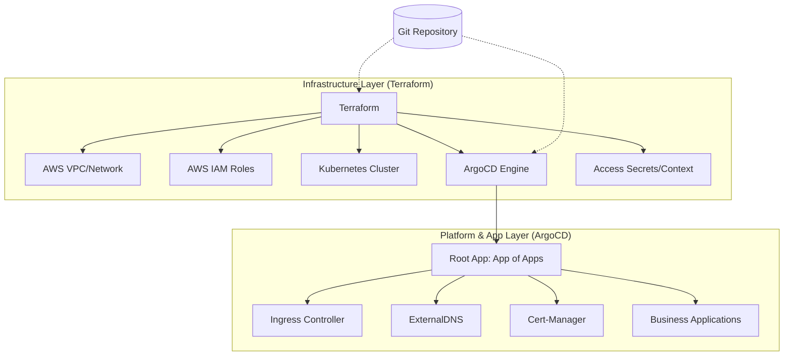

# 테라폼(Terraform) vs 아르고CD(ArgoCD) 역할 분담 가이드

이 문서는 GitOps 체계에서 인프라 관리 도구(Terraform)와 애플리케이션 동기화 도구(ArgoCD)가 각각 어떤 영역을 담당하는지 정의합니다.

## 아키텍처 개요

---

## 1. 테라폼의 역할 (Foundation & Engine)

테라폼은 **"GitOps가 동작하기 위한 판"**을 짜는 역할을 수행합니다.

- **인프라 프로비저닝**: VPC, Subnet, Security Group, EC2, S3 등 클라우드 자원 생성.
- **GitOps 제어 평면 구축**: Kubernetes 클러스터 내에 ArgoCD 엔진(Helm Chart)을 설치.
- **접근 권한 관리 (Access)**: 
    - ArgoCD가 Git 리포지토리(SSH Key)에 접근할 수 있도록 Secret 생성.
    - ArgoCD가 Harbor OCI Registry에 접근할 수 있도록 인증 정보 주입.
- **동적 컨텍스트 제공 (Context)**: 인프라 계층의 정보(VPC ID, ACM ARN, Route53 Zone ID 등)를 Kubernetes `Secret`(`infra-context`) 형태로 생성하여 앱 레이어에서 참조하도록 전달.
- **부트스트랩 트리거**: 최초의 **Root Application (App-of-Apps)** 매니페스트를 적용하여 GitOps 동기화 사이클을 시작함.

---

## 2. 아르고CD의 역할 (Platform & Workload)

아르고CD는 **"Git에 정의된 선언적 상태를 클러스터에 동기화"**하는 역할을 수행합니다.

- **플랫폼 구성 요소 관리**: Git 리포지토리의 정의에 따라 인프라 운영에 필요한 추가 소프트웨어를 관리합니다.
    - Local LB 연동을 위한 ingress-nginx
    - 인증서 자동 갱신을 위한 cert-manager
    - DNS 자동 등록을 위한 external-dns
- **애플리케이션 수명 주기 관리**: 비즈니스 앱의 배포, 롤백, 자동 동기화(Self-healing).
- **드리프트 감지**: Git에 정의된 상태와 실제 클러스터 상태가 다를 경우 이를 감지하고 원복하거나 경고를 보냄.

---

## 3. 상세 비교표

| 비교 항목 | 테라폼 (Terraform) | 아르고CD (ArgoCD) |
| :--- | :--- | :--- |
| **관리 영역** | **클라우드 자원 & GitOps 엔진** | **클러스터 내 리소스 & 앱** |
| **주요 리소스** | VPC, IAM, S3, EC2, ArgoCD Helm | Deployment, Service, Ingress, CRD |
| **입력 소스** | `.tf` 파일 (HCL) | `.yaml` 매니페스트 (K8s) |
| **동작 메커니즘** | Plan & Apply (명령형 실행) | 지속적인 Reconcile (선언적 동기화) |
| **권한 결합** | AWS IAM / Cloud API | Kubernetes RBAC (ServiceAccount) |
| **예외 케이스** | Secret 주입 등 '엔진' 가동에 필수적인 요소 | 그 외 모든 애플리케이션 운영 요소 |

---

## 💡 결론 및 권장 사항

이 구조에서 **중요한 연결 고리**는 테라폼이 생성하는 `infra-context` Secret입니다. 
테라폼이 인프라를 변경하면(예: 새로운 인증서 ARN 발생), ArgoCD는 이 Secret을 참조하여 구동되는 앱(예: Ingress)들의 설정을 자동으로 업데이트하게 됩니다.

> [!TIP]
> **책임의 분리(SoC)**를 통해 인프라 엔지니어는 테라폼 코드를, 앱 개발자는 GitOps 앱 정의를 독립적으로 관리할 수 있습니다.
