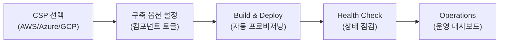

# Opsta — Cloud-Native Infrastructure Deployment Platform

> 클라우드 네이티브 인프라 자동 구축 및 운영 플랫폼

## 1. 비전

CSP별 구축 옵션을 설정하고 Build하면, 필요한 정보를 입력받고 권한을 위임받아 클라우드 네이티브 기반 인프라를 **자동으로 구축 → 점검 → 운영까지** 관리하는 배포 플래너.



## 2. 현재 → 목표 아키텍처

| 구분 | 현재 (Opstart v0.7) | 목표 (Opsta v1.0) |
|------|---------------------|-------------------|
| 프론트엔드 | HTML5 + Vanilla JS | **Next.js 14 (App Router)** |
| 백엔드 | Flask (동기) | **FastAPI** (비동기 + WebSocket) |
| 상태관리 | DOM 수동 조작 | **Zustand** + React Query |
| 인증 | 없음 | **Keycloak OIDC** (기존 인프라 활용) |
| 실시간 로그 | 폴링 (5초) | **WebSocket / SSE** |
| UI 프레임워크 | 수동 CSS | **Shadcn/UI + Tailwind** |
| 배포 | 로컬 only | Docker + K8s (자체 호스팅) |

## 3. 추천 기술 스택

### Frontend

```
Next.js 14 (App Router)
├── React 18+ (Server Components)
├── Zustand (클라이언트 상태)
├── React Query / TanStack Query (서버 상태)
├── Shadcn/UI (컴포넌트 라이브러리)
├── Tailwind CSS (스타일링)
├── Framer Motion (애니메이션)
└── next-auth / Keycloak OIDC adapter (인증)
```

> **Next.js를 선택한 이유**: SSR로 초기 로딩 성능 확보, App Router의 서버 컴포넌트로 API 호출 최적화, 파일 기반 라우팅으로 빠른 개발. 관리 콘솔 성격이므로 Vite + React SPA도 대안이지만, 향후 멀티 테넌트/고객 포탈 확장 시 Next.js가 유리.

### Backend

```
FastAPI (Python 3.11+)
├── Pydantic v2 (데이터 검증)
├── WebSocket (실시간 배포 로그)
├── Celery + Redis (비동기 작업 큐)
├── SQLAlchemy + Alembic (DB/마이그레이션)
└── Terraform SDK / Pulumi (IaC 엔진)
```

> Flask → FastAPI 전환 시, 기존 `app.py`의 라우트 구조를 거의 그대로 유지할 수 있음 (데코레이터 문법 유사). WebSocket은 FastAPI 네이티브 지원.

### 인프라/DevOps

```
Docker Compose (로컬 개발)
├── PostgreSQL (메타데이터)
├── Redis (작업 큐/캐시)
├── Keycloak (인증 — 기존 인프라)
└── Harbor (컨테이너 레지스트리 — 기존 인프라)
```

## 4. 핵심 기능 모듈

### 4.1 Deployment Planner (배포 플래너)

| 기능 | 설명 |
|------|------|
| CSP 선택 | AWS / Azure / GCP 선택, 리전 설정 |
| 컴포넌트 토글 | RKE2, Vault, Keycloak, Harbor, Teleport 등 ON/OFF |
| 의존성 그래프 | 컴포넌트 간 의존성 자동 표시 (Mermaid 시각화) |
| 비용 예측 | CSP별 예상 비용 산출 |

### 4.2 Build Configurator (빌드 설정기)

| 기능 | 설명 |
|------|------|
| 파라미터 입력 | VPC CIDR, 도메인, 인스턴스 타입 등 |
| 템플릿 관리 | 사전 정의된 구축 프로파일 (Small/Medium/Large) |
| 변수 검증 | Pydantic 기반 실시간 유효성 검사 |
| Dry-run | `terraform plan` 미리보기 |

### 4.3 Infrastructure Automation (인프라 자동화)

| 기능 | 설명 |
|------|------|
| 권한 위임 | AWS IAM Role Assumption / Azure SP / GCP SA |
| 단계별 실행 | Terraform Apply → Helm → Post-config |
| 실시간 로그 | WebSocket 기반 배포 진행 상황 |
| 롤백 | 실패 시 자동 롤백 지원 |

### 4.4 Health Check & Operations (점검/운영)

| 기능 | 설명 |
|------|------|
| 자동 점검 | 현재 9-Step Wizard의 확장 버전 |
| 모니터링 | Grafana 연동, 클러스터 리소스 대시보드 |
| 이벤트 로그 | 배포/변경 이력 관리 |

## 5. 마이그레이션 로드맵

### Phase 1: 현재 Opstart 안정화 ✅
- [x] Step 상태값 버그 수정 (`stepStates` 맵)
- [x] 콘솔 상세 로그 및 CLI 모드
- [x] `checkStatus` 모든 상태 로깅

### Phase 2: 프로젝트 초기화
- [ ] Next.js + TypeScript 프로젝트 생성 (`ops/opsta/`)
- [ ] Shadcn/UI + Tailwind 기본 설정
- [ ] Keycloak OIDC 인증 연동
- [ ] 현재 9-Step을 React 컴포넌트로 마이그레이션

### Phase 3: 백엔드 전환
- [ ] FastAPI 프로젝트 생성
- [ ] 기존 Flask 라우트 → FastAPI 마이그레이션
- [ ] WebSocket 실시간 로그 스트리밍
- [ ] Celery 작업 큐 (장시간 배포 작업)

### Phase 4: 배포 플래너 확장
- [ ] CSP 선택 UI + 컴포넌트 토글
- [ ] Terraform 변수 자동 생성
- [ ] 배포 진행 상황 실시간 모니터링
- [ ] 멀티 테넌트 지원

## 6. 프로젝트 디렉토리 구조 (예상)

```
ops/opsta/
├── frontend/                   # Next.js 14
│   ├── app/
│   │   ├── (auth)/             # 인증 관련 페이지
│   │   ├── dashboard/          # 운영 대시보드 (현재 Opstart)
│   │   ├── planner/            # 배포 플래너
│   │   └── settings/           # 설정
│   ├── components/
│   │   ├── ui/                 # Shadcn 컴포넌트
│   │   ├── wizard/             # 스텝 위자드 컴포넌트
│   │   └── console/            # 실시간 로그 콘솔
│   └── lib/
│       ├── api.ts              # API 클라이언트
│       └── store.ts            # Zustand 스토어
├── backend/                    # FastAPI
│   ├── api/
│   │   ├── routes/
│   │   └── models/
│   ├── services/
│   │   ├── terraform.py        # IaC 엔진
│   │   └── health_check.py     # 상태 점검
│   └── workers/
│       └── deploy.py           # Celery 작업
├── docker-compose.yml
└── README.md
```
